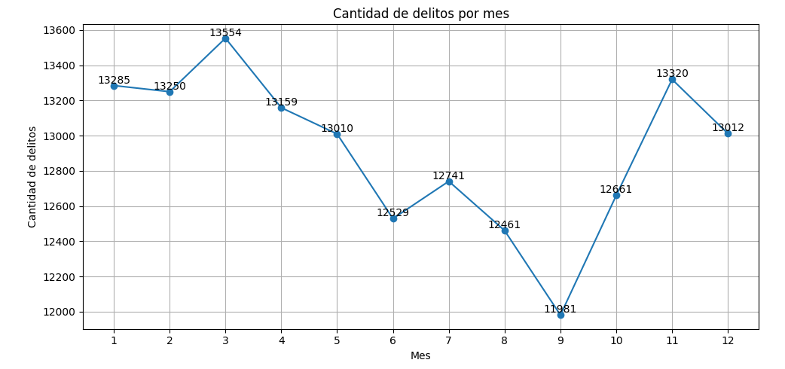
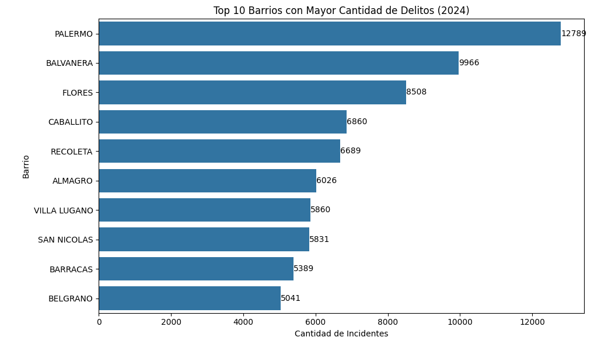
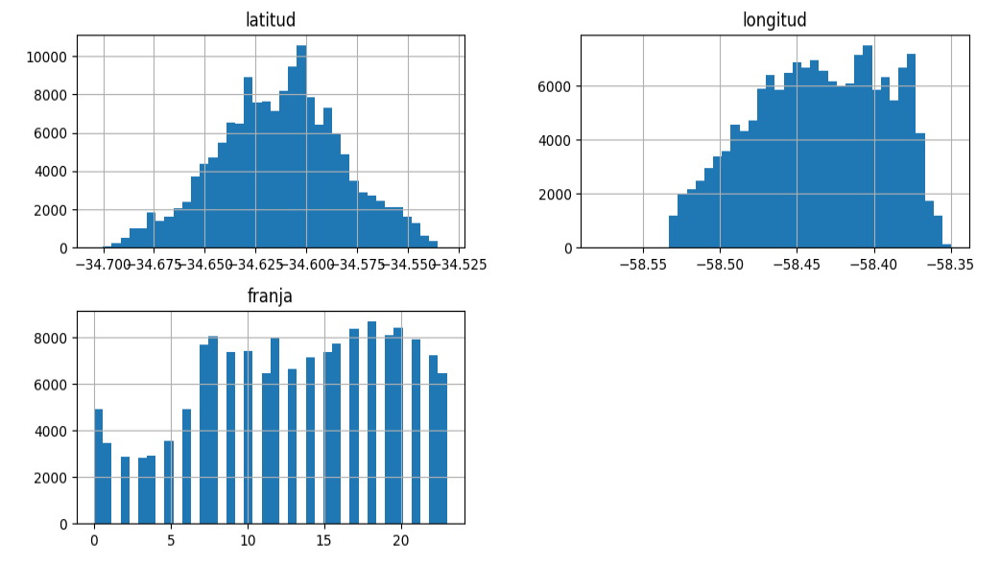
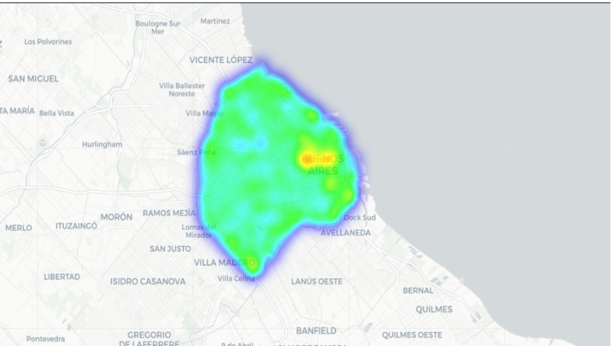
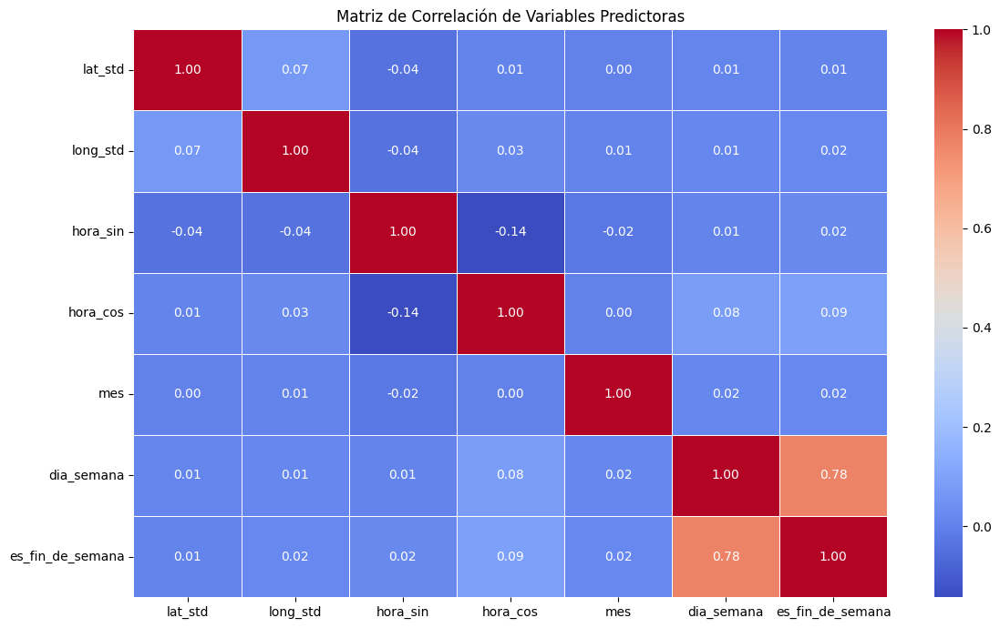
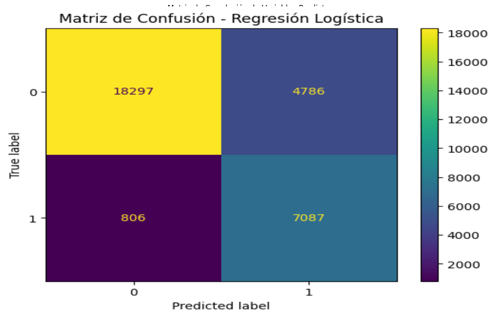
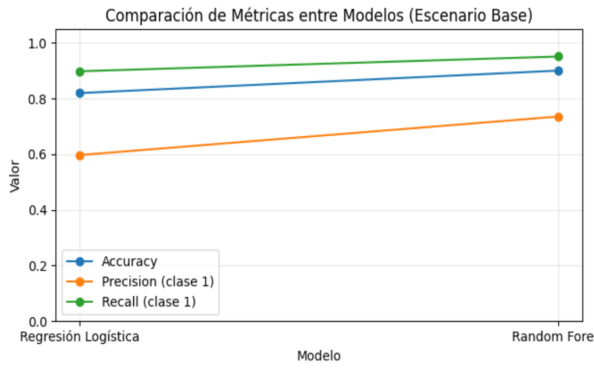
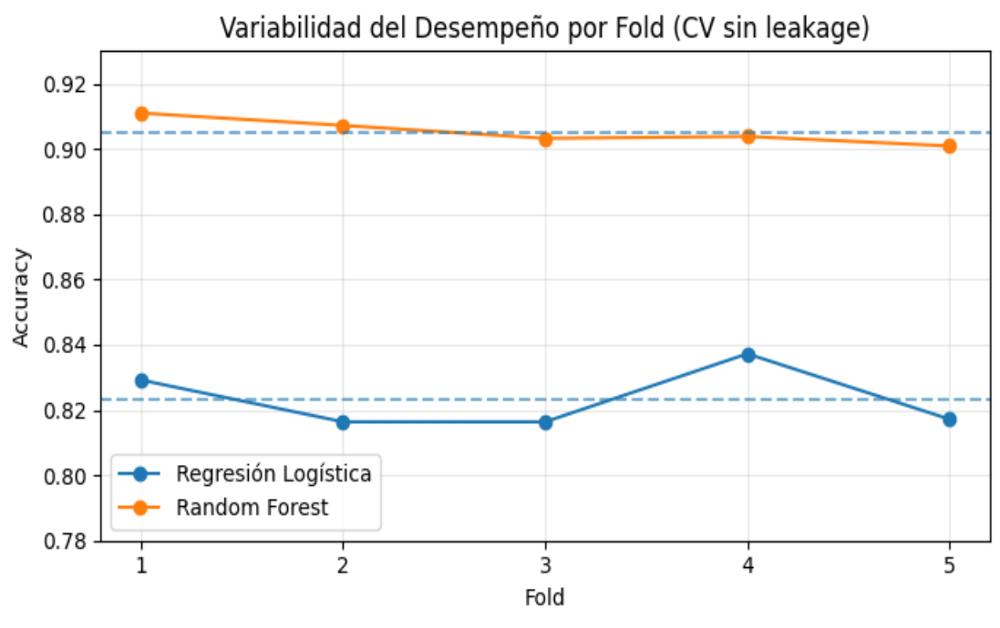

# Análisis Geoespacial de Delitos en CABA (2024) – Machine Learning

Proyecto de **Machine Learning aplicado a datos reales**, con enfoque **geoespacial y temporal**, orientado a la identificación de **zonas de alta concentración histórica de delitos (hotspots)** en la Ciudad Autónoma de Buenos Aires.

Este trabajo corresponde a la **pre‑entrega aprobada** del curso de **Machine Learning – Talento Tech 2026**, destacada por presentar un enfoque geoespacial especialmente interesante y un nivel de desarrollo superior al requerido para esta instancia.

---

## 📌 Objetivo del proyecto

Analizar la distribución **espacial y temporal** de los delitos registrados en CABA durante 2024 y construir un **modelo de clasificación** que estime la probabilidad de que una observación pertenezca a una **zona de alta concentración histórica de delitos**, a partir de variables geográficas y temporales.

> ⚠️ El modelo **no predice delitos individuales**, sino la pertenencia a zonas con alta densidad histórica bajo determinadas condiciones espacio‑temporales.

---

## 📂 Dataset

- **Fuente:** Gobierno de la Ciudad de Buenos Aires – Datos Abiertos  
- **Dataset:** Delitos registrados en CABA (año 2024)  
- **Tipo de datos:** Geográficos, temporales y categóricos  

🔗 **Link al dataset:**  
https://data.buenosaires.gob.ar/dataset/delitos

El dataset contiene información sobre hechos delictivos registrados oficialmente, incluyendo fecha, hora, tipo de delito, barrio y coordenadas geográficas (latitud y longitud).

---

## 🛠️ Tecnologías y herramientas

- **Lenguaje:** Python  
- **Entorno:** Google Colab  
- **Librerías:**
  - Pandas, NumPy
  - Matplotlib, Seaborn
  - Scikit‑learn
- **Control de versiones:** GitHub

---

## 🔍 Metodología y desarrollo

### 1️⃣ Análisis Exploratorio de Datos (EDA)

- Exploración de la estructura general del dataset
- Análisis de valores nulos y consistencia
- Distribución temporal:
  - Delitos por mes
  - Delitos por hora y franja horaria
  - Comparación entre días de semana y fines de semana
- Análisis categórico:
  - Tipos y subtipos de delitos más frecuentes
  - Barrios con mayor cantidad de incidentes
- Análisis geoespacial:
  - Distribución de coordenadas
  - Mapas de concentración territorial

---

### 2️⃣ Limpieza y preparación de datos

- Conversión de variables de fecha y hora
- Eliminación de registros con valores nulos en variables críticas (latitud, longitud, franja horaria)
- Validación de rangos horarios
- Evaluación del impacto de la limpieza sobre el volumen de datos

---

### 3️⃣ Ingeniería de características

- Creación de variables temporales (mes, día de la semana, fin de semana)
- Transformación cíclica de la hora (seno y coseno)
- Estandarización de coordenadas geográficas
- Construcción de una grilla espacial
- Cálculo de densidad relativa de delitos por celda

---

### 4️⃣ Variable objetivo (hotspot)

Se define la variable **zona_caliente (hotspot)** a partir de la densidad de delitos en la grilla espacial, utilizando un **umbral basado en percentiles** de la distribución.

Esta decisión metodológica permite operacionalizar el concepto de hotspot de forma reproducible, manteniendo un equilibrio entre sensibilidad y especificidad.

---

### 5️⃣ Modelado predictivo

Se entrenaron y evaluaron modelos de clasificación:

- **Regresión Logística**
- **Random Forest**

Incluye:
- Separación train/test
- Validación cruzada sin data leakage
- Métricas de evaluación:
  - Accuracy
  - Precision (clase hotspot)
  - Recall (clase hotspot)
- Comparación de desempeño y estabilidad entre modelos

---

## 📊 Visualizaciones del proyecto

### 🔹 Distribución mensual de delitos

Cantidad de delitos registrados por mes durante 2024, permitiendo identificar patrones estacionales.

---

### 🔹 Barrios con mayor cantidad de delitos

Top 10 de barrios con mayor número de incidentes registrados, evidenciando la concentración territorial del delito.

---

### 🔹 Distribución espacial y horaria

Histogramas de latitud, longitud y franja horaria que reflejan la concentración espacial y temporal de los delitos.

---

### 🔹 Mapa de calor geoespacial

Mapa de calor que representa la densidad espacial de delitos en la Ciudad de Buenos Aires y permite identificar zonas calientes (hotspots).

---

### 🔹 Matriz de correlación

Matriz de correlación entre variables predictoras espaciales y temporales, mostrando baja multicolinealidad.

---

### 🔹 Matriz de confusión – Regresión Logística

Evaluación del desempeño del modelo de Regresión Logística en la clasificación de zonas calientes y no calientes.

---

### 🔹 Comparación de métricas entre modelos

Comparación de accuracy, precision y recall entre Regresión Logística y Random Forest en el escenario base.

---

### 🔹 Validación cruzada por fold

Variabilidad del desempeño por fold en validación cruzada, mostrando mayor estabilidad del modelo Random Forest.

---

## 📈 Resultados principales

- El enfoque geoespacial permite capturar patrones claros de concentración delictiva.
- Random Forest presenta mejor desempeño general y mayor estabilidad.
- Las variables espaciales y temporales aportan información complementaria con baja correlación entre sí.

---

## ⚠️ Limitaciones

- El dataset incluye solo delitos registrados oficialmente, lo que implica posible subregistro.
- Las zonas con mayor tránsito pueden concentrar más delitos absolutos sin implicar mayor riesgo individual.
- El análisis es histórico y no constituye una predicción operativa de riesgo futuro.

---

## ✅ Conclusión

El proyecto demuestra cómo el análisis geoespacial combinado con Machine Learning permite identificar patrones espaciales y temporales relevantes en datos reales de delitos.

Este trabajo sienta las bases para futuros desarrollos predictivos más avanzados, siempre con una interpretación responsable y crítica de los resultados.

---

## 📓 Notebook

El desarrollo completo se encuentra documentado en el notebook, incluyendo código, visualizaciones e interpretaciones:

> Notebook desarrollado en Google Colab y versionado en GitHub.

---

## 📌 Autor

**Gerardo Medina Villalba**  
Curso **Machine Learning – Talento Tech 2026**
